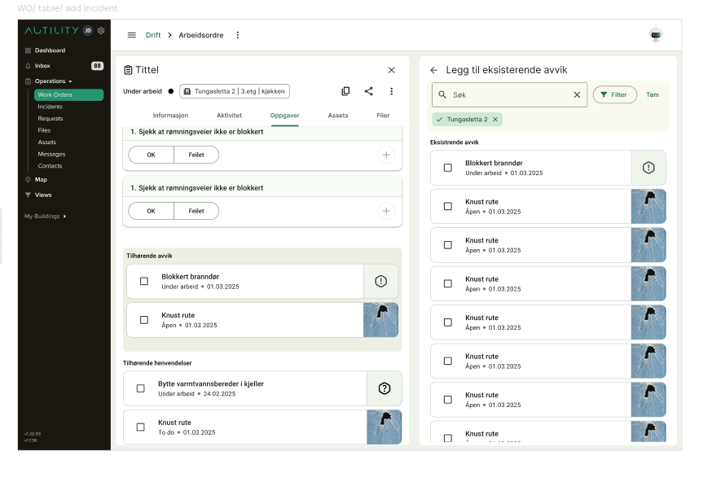

<h1>Tilknytning</h1>

<h3> Hovedpunkt </h3>

- [ ] Åpne sidebar 2
- [ ] Vis en spesifikk komponent i sidebar 2
- [ ] Lag tabell og fyll med data
- [ ] Legg til for andre entiteter (avvik, hendvendelser, assets, filer)
- [ ] Legg til sjekkbokser og fiks funksjonalitet for valg og lagring...
- [ ] Søk og filtre
- [ ] Tester

<h5> Forventet resultat </h5>

<h5>Del 1</h5>
Oppdater <a href="src/app/layout/new-right-sidebar/services/new-right-sidebar/new-right-sidebar.service.ts">new-right-sidebar-service</a> med variabler og funksjoner for second sidebar. IsOpen, isclose...
 
Når sidebar 2 åpnes må vi sørge før at sidebar 1 beveges til venstre med en animasjon. Det kan gjøres med ganske enkel scss.
 
Deretter vil jeg fokusere på å vise en komponent i sidebar 2. Dette er for å se hvordan det kommer til å se ut, og enklere kunne style området rundt sidebarene.
 
Sidebaren skal ha en &larr; pil som jeg vil fokusere på først, siden det er core funksjonalitet. Samt at krysset skal lukke begge sidebarene. Når sidebaren kan åpnes og lukkes på en grei måte ved hjelp av en funksjon slik som sidebar 1 kan gjøres er Del 1 ferdig. 
For å vise pilen må jeg lage en slags parent komponent for sidebar 2. Dette gjør det også enklere å legge inn tittelen som skal stå ved siden av.
Jeg vet at vi også vil bruke sidebar 2 til ting som sjekkliste og nye entiteter, derfor vil jeg gjøre slik at parenten ikke alltid blir åpnet, men kun hvis man åpner med tilknytning som type. Deretter kan flere komponenter lages og åpnes for andre ting.
  

<b>Teknisk:</b> 
Jeg tenker å bruke mat-overlay for sidebaren siden det er gjort for sidebar 1 allerede
Ng-content brukes for å vise frem content på siden. 
Mat-Icon-Module og andre material pakker kan brukes for ting som ikon, knapper...

<h5>Del 2</h5>

I del 1 planlegger jeg å lage en parent komponent. Denne kan brukes til å legge tabellen under. Tabell komponenten skal åpnes med input om tilknytningstype som skal si noe om hvilken entitet som skal vises frem(avvik, filer...). Den skal vise entitene som kort med en sjekkboks, tittel, litt data og bilde/ikon av entitetstype.

Vi vil også legge inn tittel og undertittel ved å bruke åpnet entitetstype. Typen må allerede være delt i Parenten siden det skal stå i header på siden. Dette fikser vi ved å sende inn entitetstype samtidig som vi åpner sidebaren og sender inn at tilknytnings tabellen skal åpnes. Her trenger vi også Arbeidsordre data, som tidligere valgte entiteter osv...

Når sjekkbokser markeres får vi en selectionModel til å holde styr over hvilke som er markert og ikke. Deretter skal dataen oppdateres når sidebaren lukkes.

Til slutt legger vi inn søkefelt komponenten for å kunne søke etter spesifikke navn og filter. Søkefeltet kan brukes fra tidligere siden det nylig er omskrevet, filteret må egentlig lages nytt, men for å spare tid bruker vi et gammelt ett midlertidlig. 

Også skriver vi tester

<b>Teknisk:</b>
Mat-Card blir brukt for å vise frem entitetene. 
I tillegg er jeg mest kjent med SelectionModel for å håndtere sjekkbokser, så jeg vil bruke det for å holde styr over de. Den kommer med mange gode verktøy som toggle() som toggler sjekkboksen. Og comparison, som gjør at å vise tidligere valgte sjekkbokser blir mye enklere.
Vi oppdaterer når sidebaren lukkes ved hjelp av NgOnDestroy

<b>Diskusjon</b>
Bruk vanlig komponent (må kunne switche)
- Pros: Simpelt, kan bruke input/output for data, 
- Cons: Vanskeligere å lese, trenger spesifikk state handling.
  
Bruk Overlay 
- Pros: Kan ta masse data. Ideelt for dynamisk data. 
- Cons: Kan ikke åpne hvor som helst /må importere effects og nødvendige komponenter.

Bruk Router-outlet
- Pros: Kan åpne hvor som helst. Enkelt å hente frem. Smart åpne, lukke funksjon. RouterReuseStragety kan "store" routen. 
- Cons: Kan ikke ta mye data. Mindre fleksibilitet på posisjonering

State handling
1. Må åpne liste over ting.
2. Må kunne filtreres.
3. Må kunne tilknytte.
4. Må være reaktivt.

Kilder: 
 
https://dimitri.codes/content-sidebar-angular-routing/
 
https://angular.dev/api/router/RouteReuseStrategy
 
https://medium.com/@oranaki9910/how-to-create-a-dynamic-layout-using-a-named-router-outlet-in-angular-8f211afe4ea2
