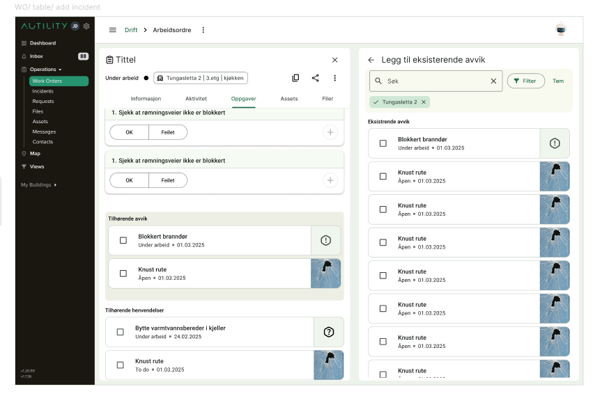

<h1>Attaching</h1>

<h3> Main points </h3>

- [ ] Open sidebar 2
- [ ] Show a specific komponent in sidebar 2
- [ ] Make table and fill with data
- [ ] Add for other entities (incidents, requests, assets, files)
- [ ] Add checkboxes and create selection functionality...
- [ ] Search and filters
- [ ] Tests

<h5> Expected result </h5>

<h5>Part 1</h5>
Update <a href="src/app/layout/new-right-sidebar/services/new-right-sidebar/new-right-sidebar.service.ts">new-right-sidebar-service</a> with variables and functions for second sidebar. IsOpen, isclose...
 
When sidebar 2 is opened, it should push sidebar 1 to the left with a animation.
 
Then i will focus on showing a component in the sidebar. This is to see where the final product will be set and makes it easier to style while in progress.
 
Sidebaren should have a &larr; arrow that i want to focus on first, since its one of the main parts of the sidebar. Additionally the X should close both sidebars. When the sidebar can be opened with an easy function like sidebar 1 this part is done. 
To show the arrow for sidebar 2 i either need to make a parent component or place it everywhere that will use sidebar 2. With this we can also create the title for the page.
Sidebar 2 will be used for several different things, so i want to make sure that its working dynamically.
  

<b>Teknisk:</b> 
Mat-overlay was used when creating sidebar 1, so i plan on using that here
Ng-content is used to show the component
Mat-icon module and other angular material modules will be used

<h5>Part 2</h5>
In part 1, I plan to create a parent component. This can be used to place the table underneath. The table component should be opened with input about the association type, which will indicate what kind of entity is being displayed (deviations, files, etc.). It will show the entities as cards with a checkbox, title, some data, and an image/icon representing the entity type.

We will also add a title and subtitle by using the opened entity type. The type must already be shared in the Parent since it should appear in the page header. We’ll handle this by sending in the entity type at the same time as we open the sidebar and indicate that the association table should be opened. We also need Work Order data, such as previously selected entities, etc.

When checkboxes are marked, we use a SelectionModel to keep track of what is selected and what is not. Then the data will be updated when the sidebar is closed.

Finally, we will include the search field component to search for specific names and apply filters. The search field can be reused from earlier since it was recently rewritten, and the filter will be temporarily reused from an older version to save time.

We will also write tests.

<b>Technical:</b>
Mat-Card will be used to display the entities.
In addition, I’m most familiar with SelectionModel to handle checkboxes, so I will use it to manage them. It comes with many useful tools such as toggle() to toggle the checkbox, and comparison, which makes it much easier to display previously selected checkboxes.
We update the data when the sidebar is closed using NgOnDestroy.

<b>Discussion</b>
Use regular component (must be able to switch)

Use Overlay

Pros: Can handle a lot of data.

Cons: Can’t open just anywhere / must import effects and necessary components.

Use Router-outlet

Pros: Can open anywhere. Easy to retrieve.

Cons: Can’t handle a lot of data.

State handling

Must open list of items.

Must support filtering.

Must allow associations.

Must be reactive.

Sources: 

https://dimitri.codes/content-sidebar-angular-routing/ 
